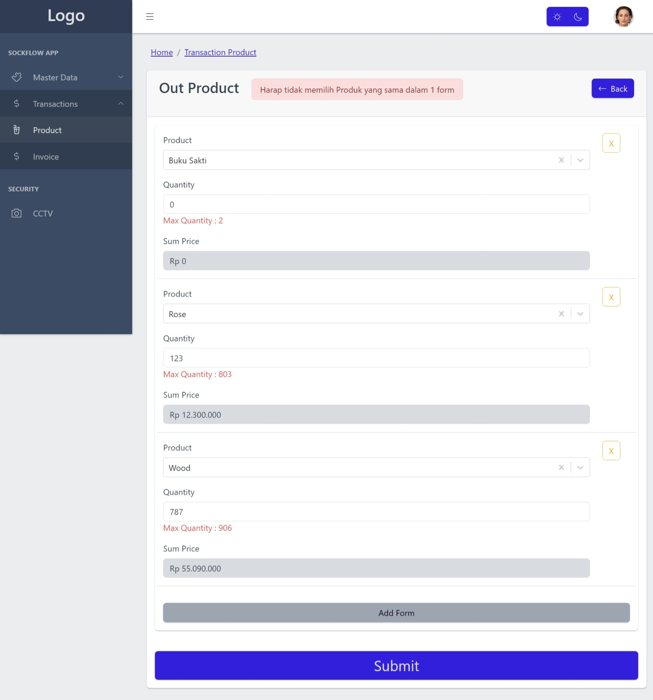
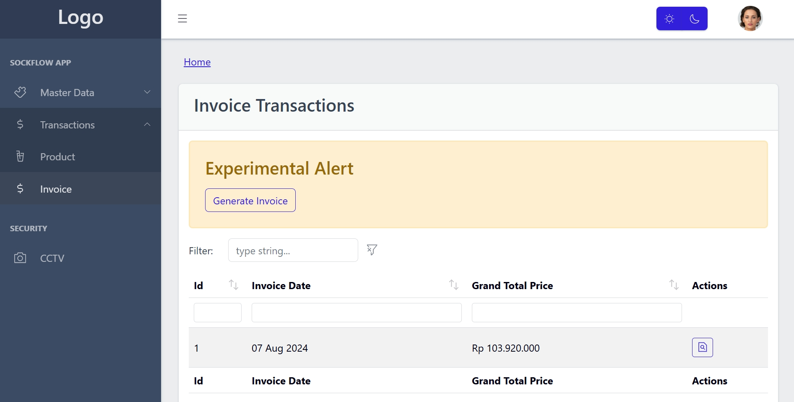

# :fallen_leaf: Stockflow App

Stockflow is a Web App that Monitor on Management of the Product stock, transactions and the auto generated invoice.

### FE Tech Stack :trumpet:

- React
- Javascript + Typescript
- Redux Toolkit
- Tailwind
- Bootstrap

### BE Tech Stack :trumpet:

- Nest Js
- Typescript
- Postgresql

# Back End : [Stockflow-BE](https://github.com/Hasyim-Kai/stockflow-be)

#### Project Folder Structure

```
stockflow-folder-structure
├── api/            # for api call based on each domain
├── store/          # for redux toolkit and rtk query initiation
├── utils/          # contain helper function to ease diplaying & processing data
├── sidebar-nav/    # contain sidebar nav item based on each role
├── pages/          # contain pages for each routes, the page folder structure
                    follow Next js   pages folder practices
├── component/      # For the basic component
│   └── global/     # Basic component for global use
```

## :camera: Screenshots

## :star: Master Data User


<br>

## :star: Master Data Product & Form


<br>

## :star: Transaction Prodcut List


<br>

## :star: Transaction Prodcut Form


<br>

## :star: Transaction Prodcut Detail


<br>

## :star: Transaction Invoice List


<br>

## :star: Transaction Invoice Detail


<br>

## :star: Transaction Invoice PDF Generated


<br>
